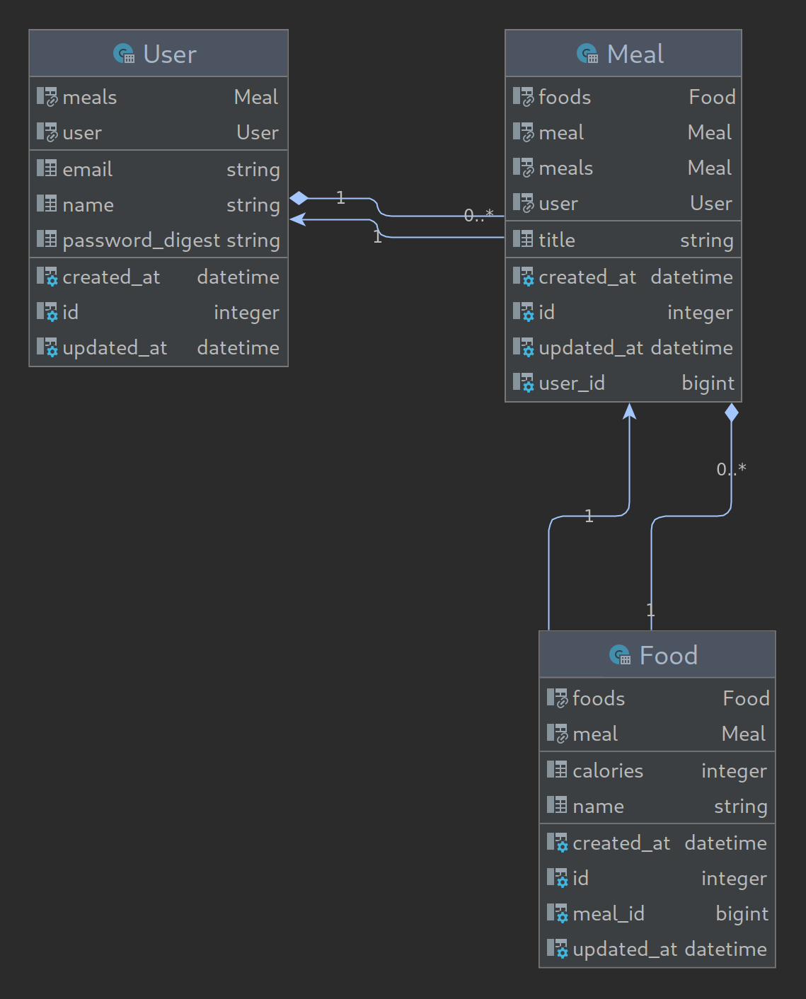

# Dietify Backend

Dietify - Calorie counting for weight management shouldn't be hard. Dietify helps you to keep track of your calorie intake.
This is an api backend for the the the Dietify application. 

## Built With

- Ruby 3.0.2
- Rails 6.1.4
- JWT Gem 1.5
- Postgresql

## ERD

The relationship between models can be seen in the ERD diagram below.



### Prerequisites
- Ruby >=3.0.2
- Rails >=6.1.4
- Postgresql >10

### Setup
In order to run this app on your local environment:

- Clone the project on your local machine with the following command.
```bash
git clone git@github.com:sinansevgi/dietify.git
```
- Navigate to the project directory 
- Run the following command to install dependencies
```bash
bundle install 
```
- You should create required databases and tables before running the application.
- Run the following command to create databases and tables
```ruby
rails db:create 
rails db:migrate
```
- If you want to load demo data to test the application, you can use the following command to seed a database with demo data
```ruby
rails db:seed
```
- You can run the API server with the following command
```ruby
rails s
```

## Authors

👤 **Sinan Sevgi**

- GitHub: [@sinansevgi](https://github.com/sinansevgi)
- LinkedIn: [@sinansevgi](https://www.linkedin.com/in/sinansevgi/)
- Portfolio: [Website](https://sinansevgi.com)

## Contributing 🤝

Contributions, issues, and feature requests are welcome!

## Support

Give a ⭐️ if you like this project!


## 📝 License

This project is [MIT](./LICENSE) licensed.